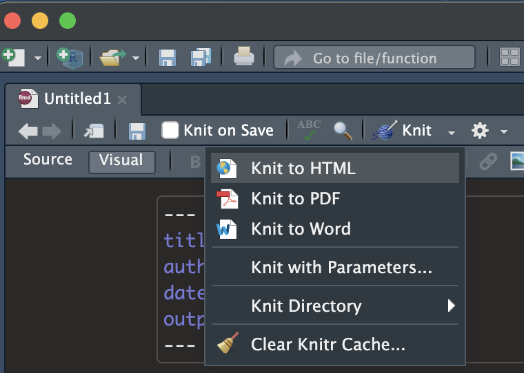
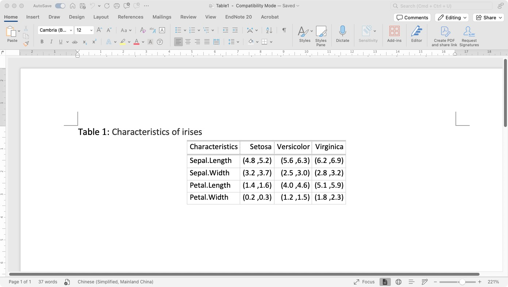

```{r setup, include=FALSE}
# set default global options
knitr::opts_chunk$set(echo = FALSE)
options(knitr.table.format = "html")

# load packages
library(xaringanthemer)
library(xaringanExtra)
library(tidyverse)
#remotes::install_github("mitchelloharawild/icons")
library(icons)
#remotes::install_github("hadley/emo")
library(emo)
library(kableExtra)
library(gt)

# set engines
xaringanExtra::use_tile_view()
xaringanExtra::use_panelset()
```

```{r xaringan-themer, include=FALSE, warning=FALSE}
# generate your own theme
dark_yellow <- "#EFBE43"
light_yellow <- "#FDF7E9"
gray <- "#333333"
blue <- "#4466B0"
style_duo(
  # colors
  primary_color = light_yellow,
  secondary_color = dark_yellow,
  header_color = gray,
  text_color = gray,
  code_inline_color = colorspace::lighten(gray),
  text_bold_color = colorspace::lighten(gray),
  link_color = blue,
  title_slide_text_color = blue,

  # fonts
  header_font_google = xaringanthemer::google_font("Martel", "300", "400"),
  text_font_google = xaringanthemer::google_font("Lato", "400"),
  code_font_google = xaringanthemer::google_font("Fira Mono"),
  text_font_size = "1.3rem"
)
```


class: title-slide, left, bottom

# `r rmarkdown::metadata$title`

### **`r rmarkdown::metadata$subtitle`**
** `r rmarkdown::metadata$author`**
[`r fontawesome::fa("github", a11y = "sem")`](https://github.com/yuchanmou)<br>
`r rmarkdown::metadata$institute`<br>
`r Sys.Date()`

---
class: center, middle

background-image:url("../presentation/images/infinity.png")
background-position: 50% 50%, 10% 10%
background-size: 50%, cover

---
class: inverse, center, middle

# Get Started

---
class: center, middle

## Wait...I just mastered R!!!


---

## Here's the plan B

.my-coral[A multi-functional R script!] `r fontawesome::fa("r-project", height = "1.5em")`

--

R Markdown provides an authoring framework for data science.<br>

You can use a single R Markdown file to:

--

- **Save and execute code**

--

- Generate **high quality reports** that can be shared with an audience

--

- Designed for easier **reproducibility**

???

both the computing code and narratives are in the same document
results are automatically generated from the source code.

---
class: center, middle

# How does it work?


---
class: inverse, center, middle

# My workflow

---
class:center, middle

```{r workflow, echo = FALSE, fig.cap = 'My R Markdown workflow', out.width = '65%', fig.align='center', cache=TRUE}
library(nomnoml)
nomnoml::nomnoml(
  "
  [<frame>Workflow|
  [Git/Github]-> [R Markdown]
  [Data processing|| Data manipulation|| Data analysis|| Data output]
  [R Markdown]-> [Data processing]
  [Data processing]-> [Raw results]
  [Data processing] --> [Git/Github]
  [Raw results]-> [Reports]
  [Reports|| Visualization|| Tables || Figures ]
  [Reports]-> [HTML]
  [Reports]-> [Word]
  [Reports]-> [PDF]
  [Reports]-> [Slides]
  ]")
```

---

## R Markdown anatomy

.panelset[
  .panel[.panel-name[YAML header]
Also called YAML metadata
```{r yaml-header, eval=FALSE, echo=TRUE}
---
  title: My R Markdown Report
  author: Yuchan Mou
  output: html_document
    toc: TRUE
    toc_float: TRUE
---
```
  ]
  .panel[.panel-name[Narrative]
Simple text with [markdown formatting](https://www.markdownguide.org/cheat-sheet/)<br>

|  Element    | Syntax     |
| ----------- | ----------- |
| Heading | # Heading level 1<br> ## Heading level 2<br> ### Heading level 3<br> |
| Bold | \*\*bold text** |
| Italic | \*italicized text* |
| Link | \[title](https://www.example.com) |
| Image | \!\[img](image.jpg) |
  ]
  .panel[.panel-name[Code chunks]

chunk header
````md 
```{r simple plot, echo=T, eval=F}`r ''`
````

chunk body
````md
# Title

## Section X

This is my results.

```{r simple plot, echo=T, eval=F}`r ''`
fit = lm(dist ~ speed, data = cars)
b   = coef(fit)
plot(cars)
```
````
  ]
]


---

## Preliminary Results

--

`r fontawesome::fa("code")` Coding, but in .my-red[code chunk]

--

`r fontawesome::fa("html5")` Click .my-red[knit to html]



--

`r fontawesome::fa("face-smile-wink")` .my-red[DONE!]

.right[.my-coral[example on next slide `r fontawesome::fa("arrow-circle-right")` ]]

---

###[Tables](../presentation/3.data_synthesis_27NOV2023.html)<br>

###[Figures](../presentation/11.Correlations_afterDSA.html)

###[Combined](../presentation/3a_descriptive_analysis_all_raw_data.html)

---

## Main Results
```{r tbl1}
library("scrutiny")
iris %>% 
  group_by(Species) %>% 
  reframe(across(Sepal.Length:Petal.Width, ~ quantile(.x, c(0.25, 0.75)))) %>% 
  data.table::transpose(keep.names = 'Characteristics') %>% 
  rename(
    setosa_0.25 = V1,
    setosa_0.75 = V2,
    versicolor_0.25 = V3,
    versicolor_0.75 = V4,
    virginica_0.25 = V5,
    virginica_0.75 = V6
  ) %>% 
  slice(-1) %>%  # remove first row
  mutate(across(setosa_0.25:virginica_0.75, ~as.numeric(.))) %>%
  mutate(across(setosa_0.25:virginica_0.75,~round(.,1))) %>% 
  restore_zeros_df(width = 1) %>% # keep trailing zeros
  mutate(
    Setosa = paste("(", setosa_0.25, " ,", setosa_0.75, ")", sep = ""),
    Versicolor = paste("(", versicolor_0.25, " ,", versicolor_0.75, ")", sep = ""),
    Virginica = paste("(", virginica_0.25, " ,", virginica_0.75, ")", sep = ""), 
  ) %>% 
  select(Characteristics, Setosa, Versicolor, Virginica) %>% 
  kbl(caption = "Table 1. Characteristics of irises", digits = 1, format.args = list(nsmall = 1)) %>%
  kable_classic(full_width=F, html_font = "Times New Romans")
  
```

---
```{r , eval=F, echo=T}
iris %>% 
  group_by(Species) %>% 
  reframe(across(Sepal.Length:Petal.Width, ~ quantile(.x, c(0.25, 0.75)))) %>% 
  data.table::transpose(keep.names = 'Characteristics') %>% 
  rename(
    setosa_0.25 = V1,
    setosa_0.75 = V2,
    versicolor_0.25 = V3,
    versicolor_0.75 = V4,
    virginica_0.25 = V5,
    virginica_0.75 = V6
  ) %>% 
  slice(-1) %>%  # remove first row
  mutate(across(setosa_0.25:virginica_0.75, ~as.numeric(.))) %>%
  mutate(across(setosa_0.25:virginica_0.75,~round(.,1))) %>% 
  restore_zeros_df(width = 1) %>% # keep trailing zeros
  mutate(
    Setosa = paste("(", setosa_0.25, " ,", setosa_0.75, ")", sep = ""),
    Versicolor = paste("(", versicolor_0.25, " ,", versicolor_0.75, ")", sep = ""),
    Virginica = paste("(", virginica_0.25, " ,", virginica_0.75, ")", sep = ""), 
  ) %>% 
  select(Characteristics, Setosa, Versicolor, Virginica) %>% 
  gt() %>% 
  tab_header(
    title = "Characteristics of irises"
  ) %>% 
  gt::gtsave(., "../presentation/Table1.docx")
```


---



---
class: inverse, center, middle

# PDF

---
class: left, middle

Hassle-free creation of supplementary material directly from R Markdown

- [Forestplot](../presentation/b_FigS1_ForestPlots_14June2024.pdf)

- [Tables](../presentation/Supplementary_TblS1_S12.pdf)

---
class: inverse, center, middle

# Presentation

---

## Hello R Markdown

.pull-left[
This is a paragraph in an R Markdown document.

Below is a code chunk:

```{r simple plot, echo=T, eval=F}
fit = lm(dist ~ speed, data = cars)
b   = coef(fit)
plot(cars)
abline(fit)
```
]

--

.pull-right[
```{r simple plot, fig.asp=0.7}
```

The slope of the regression is `r round(b[1], 3)`.]


---

## Table

```{r tables-mtcars}
kbl(iris[1:5, ], caption = 'Table1. A caption', align = "c")
```

---
## Multiple plots
.pull-left[ 
- Grils
```{r, results='hide', fig.show='hold', fig.asp=0.8}
plot(pressure)
```
]

.pull-right[ 
- Boys
```{r, results='hide', fig.show='hold', fig.asp=0.8}
plot(pressure)
```
]


---
## Math expr

$$f(k) = {n \choose k} p^{k} (1-p)^{n-k}$$

$$X = \begin{bmatrix}1 & x_{1}\\
1 & x_{2}\\
1 & x_{3}
\end{bmatrix}$$

---
class: left, top

## Resources

.pull-left[
- R Markdown

  [R Markdown The Definitive Guide](https://bookdown.org/yihui/rmarkdown/)

  [R Markdown Cookbook](https://bookdown.org/yihui/rmarkdown-cookbook/)

- Xaringan package  **for presentation**

  [Learning xaringan Presentations](https://irene.vrbik.ok.ubc.ca/slides/NHSRxaringan.html?panelset1=tab-12#1)
  
  [Sharing Your Work with xaringan](https://spcanelon.github.io/xaringan-basics-and-beyond/slides/day-01-basics.html?panelset4=remark.js2&panelset5=nhsrtheme2&panelset6=moon-reader2&panelset7=markdown2#1)
]

.pull-right[
- Tabulate r packages in HTML format: 

  [Kable](https://cran.r-project.org/web/packages/kableExtra/vignettes/awesome_table_in_html.html#full_width)
  , [gt](https://gt.rstudio.com/index.html)

- Interested in version control?

  [Happy Git and GitHub for the useR](https://happygitwithr.com/)
]

---

